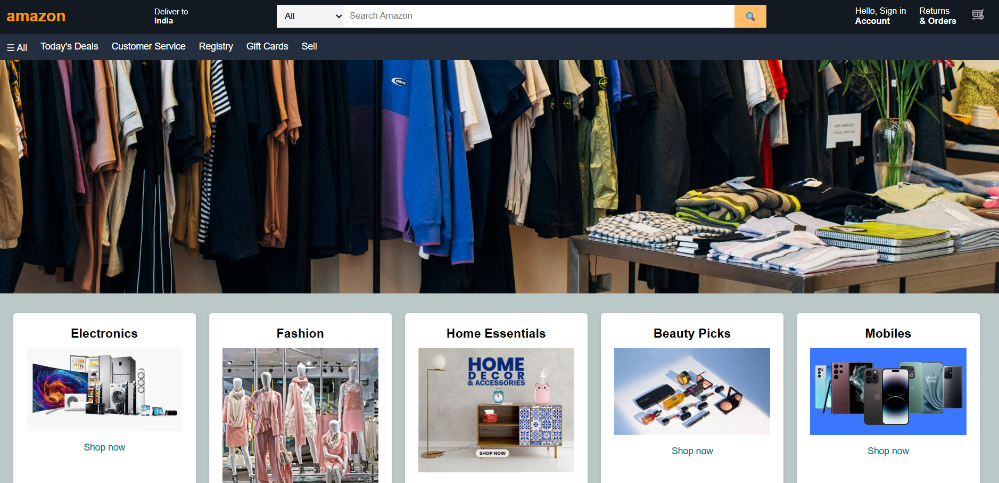

# Amazon Homepage Clone

A front-end clone of the homepage layout inspired by the e-commerce platform **Amazon**.
This project was built using **HTML, CSS, and JavaScript** to practice web layout design, responsive grids, and a simple image slider.

---

## Project Preview



---

## Features

* Amazon-style navigation bar
* Product category cards
* Image slider banner (changes every 3 seconds)
* Responsive product grid layout
* Multi-column footer similar to Amazon
* “Back to top” button
* Clean UI using HTML, CSS, and JavaScript

---

## Technologies Used

* HTML5
* CSS3
* JavaScript (Vanilla)

---

## Project Structure

```
amazon-clone
│
├── index.html
├── style.css
├── script.js
│
├── assets
│   ├── banner.jpg
│   ├── banner2.jpg
│   ├── banner3.webp
│   ├── banner4.webp
│   ├── Electronics.webp
│   ├── Fashion.webp
│   ├── screenshot.png
│   └── ...
```

---

## Future Improvements

* Add product prices and ratings
* Add cart functionality
* Add login/signup pages
* Improve mobile responsiveness
* Connect to a backend for real products

---

## Author

Raj Sharma

---

## Disclaimer

This project is created for **educational purposes only** and is not affiliated with or endorsed by Amazon.
