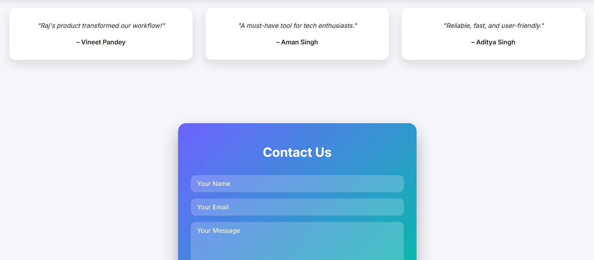
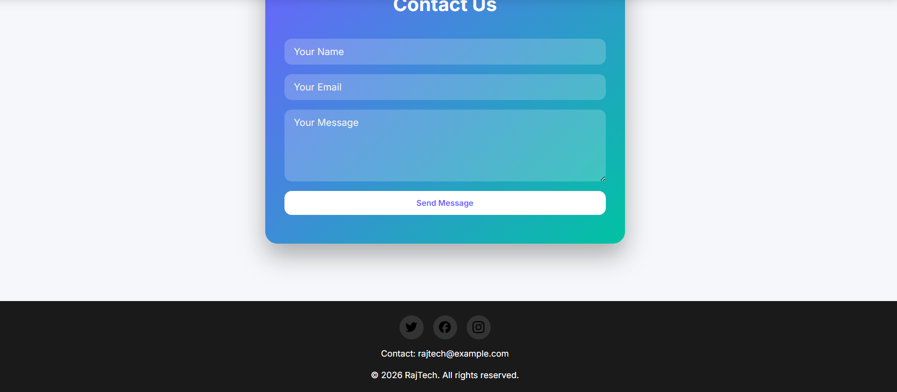

# Raj's Tech Product

A modern, responsive landing page for **RajTech's next-gen product**. Designed with sleek UI, smooth animations, and interactive features.  

---

## Table of Contents

- [Demo](#demo)  
- [Features](#features)  
- [Screenshot](#screenshot)  
- [Usage](#usage)  
- [Technologies Used](#technologies-used)  
- [Author](#author)  
- [License](#license)  

---

## Demo

You can view the live demo [here](#) (replace `#` with your live URL).

---

## Features

- **Hero Section**
  - Rotating background images every 4 seconds.
  - Gradient animated heading and paragraph text.
  - Call-to-action buttons for “Get Started” and “Learn More”.

- **Responsive Navigation**
  - Sticky navbar with smooth scrolling links.
  - Light/Dark theme toggle (🌙 icon).

- **Feature Cards**
  - ⚡ Fast Performance  
  - 🔒 Secure  
  - ☁️ Cloud Sync  
  - 💡 AI Assistance  

- **Statistics Section**
  - Displays Users, Companies, and Uptime in a visually engaging layout.

- **Pricing Plans**
  - Basic, Pro (recommended), and Enterprise plans.
  - Image hover effect and button interaction.

- **Testimonials**
  - Rotating user testimonials with clean card layout.

- **Contact Section**
  - Gradient background form with interactive inputs and submit button.

- **Footer**
  - Social media links (Twitter, Facebook, Instagram).
  - Contact email and copyright.

---

## Screenshot

  

    
 
*Screenshot created by Raj*

---

Raj – Developer & Designer of this project.

✅ This version is **complete**, ready for GitHub, includes:  

- Demo section  
- Features list  
- Screenshot placeholder  
- Installation and usage instructions  
- Technologies used  
- Author info and license  

---

If you want, I can also **add a “Hero GIF animation” section** showing the image slider in action to make it visually impressive for GitHub.  

Do you want me to add that?
