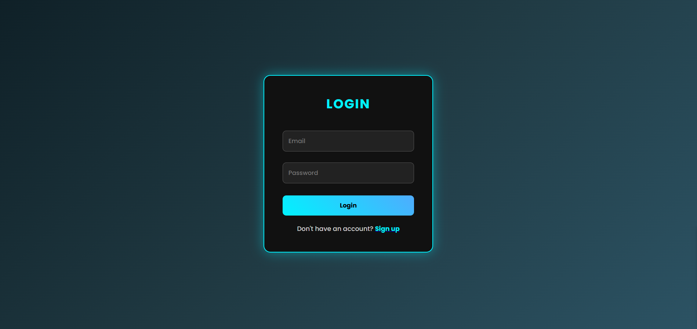

     # Login & Signup Page

## 📌 Project Description

This project is a **Neon-themed Login & Signup webpage** created using HTML and CSS.
It features a modern dark UI with glowing effects, smooth transitions, and a clean layout.

The main goal of this project is to demonstrate:

* CSS styling techniques
* Box model usage
* Responsive layout basics
* Creative UI design

---

## 🎯 Features

* 🔐 Login and Signup forms on the same page
* 🎨 Neon dark theme with gradient background
* ✨ Glow effects on inputs and buttons
* 🔄 Toggle between Login and Signup without JavaScript
* 🖋️ Custom font styling using Google Fonts

---

## 🛠️ Technologies Used

* HTML5
* CSS3
* Google Fonts (Poppins)

---

## 📚 Assignment Tasks Covered

### ✅ PART 1: COLORS

* Background gradient changed
* Button color and hover effects customized
* Input field border changes on focus

### ✅ PART 2: TEXT STYLING

* Font family updated using Google Fonts
* Heading size increased
* Headings converted to uppercase
* Letter spacing added

### ✅ PART 3: BOX MODEL (IMPORTANT)

* Container padding increased
* Border added to container
* Margin added between input fields
* Shadow (glow effect) applied

---

## 🚀 How to Run the Project

1. Open Visual Studio Code
2. Create a new file (e.g., `index.html`)
3. Paste the provided code
4. Save the file
5. Open it in your browser

---

## 💡 Unique Design Elements

* Neon glow UI (different from basic designs)
* Smooth hover animations
* Dark modern interface
* Clean and centered layout

---

## 📸 Output

A stylish login/signup interface with glowing effects and smooth user interaction.

---

## ✅ Conclusion

This project successfully demonstrates the use of CSS for styling, layout design, and visual enhancements while meeting all assignment requirements.

---

✨ *Created by Raj*
