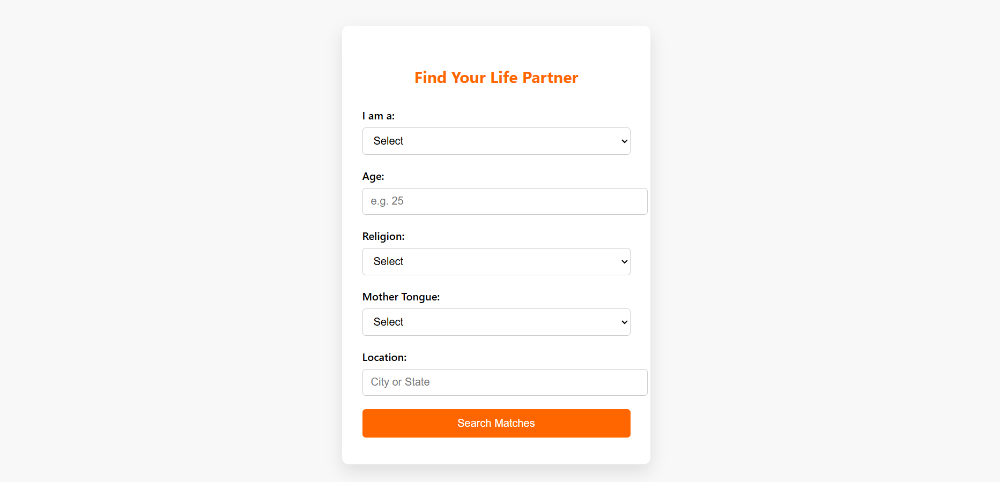

# 💍 JeevanSaathi Match Form

A simple **JeevanSaathi-style matchmaking form** built using **HTML and CSS**.
This project allows users to enter basic details like gender, age, religion, language, and location to search for a potential life partner.

The form is designed with a **clean, modern interface** and centered layout.

---

## 🚀 Features

* 🧑 Select gender
* 🎂 Age input with validation (18–100)
* 🛐 Religion selection
* 🗣️ Mother tongue selection
* 📍 Location input
* 📧 Form submission via email
* 🎨 Clean and responsive UI design
* 🖱️ Button hover effect

---

## 🛠️ Technologies Used

* **HTML5**
* **CSS3**

---

## 📁 Project Structure

```
JeevanSaathi-Form
│
├── index.html
├── style.css
├── README.md
└── favicon.png
```

---

## 📷 Form Fields

The form collects the following information:

* Gender
* Age
* Religion
* Mother Tongue
* Location

These details help simulate a **basic matchmaking search form** similar to matrimonial websites.

---

---

## 📧 Form Submission

The form uses the **mailto** method:

```
mailto:matches@jeevansaathi.com
```

When the user submits the form, their default **email client opens with the form data**.

---

## 🎨 Design Highlights

* Centered layout
* Soft shadow card design
* Clean input fields
* Orange themed button
* Smooth hover effect

---

## 👨‍💻 Author
Raj Sharma
Created for learning and practice purposes.

---

## 📄 License

This project is free to use for **educational and practice purposes**.
