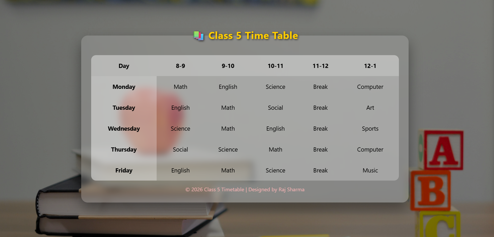

# 📚 Class 5 Timetable Website

A simple and attractive **Class 5 Timetable webpage** created using **HTML and CSS**.
This project displays a weekly school schedule in a clean table format with a modern glassmorphism design and background image.

---

## 🚀 Features

* 📅 Weekly timetable (Monday – Friday)
* 🎨 Modern **glassmorphism UI design**
* 🌄 Background image with dark overlay
* 📱 Responsive layout
* 🖱️ Hover animation on table cells
* 🧾 Footer with designer credit

---

## 🛠️ Technologies Used

* **HTML5**
* **CSS3**

---

## 📁 Project Structure

```
project-folder
│
├── index.html
├── style.css
├── README.md
│
└── assets
    ├── favicon.png
    └── time table.jpg
```

---

## 📷 Preview

The webpage shows a **Class 5 timetable** with subjects like:

* Math
* English
* Science
* Social
* Computer
* Art
* Sports
* Music

Each day contains a **break period** and different subjects scheduled between **8 AM – 1 PM**.



---

---

## ⚙️ How to Run the Project

1. Download or clone this repository.
2. Make sure the folder structure is correct.
3. Open **index.html** in any web browser.

Example:

```
double click index.html
```

or

```
Right Click → Open With → Browser
```

---

## 🎨 Design Highlights

* **Blur glass container**
* **Hover zoom effect on timetable cells**
* **Dark overlay background**
* **Centered responsive layout**

---

## 👨‍💻 Author

**Raj Sharma**

© 2026 Class 5 Timetable | Designed by Raj Sharma

---

## 📄 License

This project is free to use for **learning and educational purposes**.
